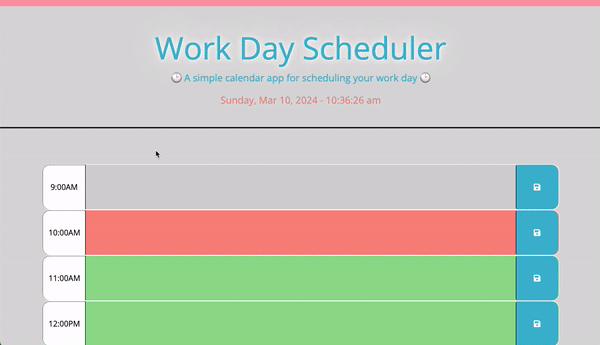

# Work Day Scheduling Calendar

## Table of Contents

* [Description](#description)
* [Usage](#usage)
* [Requirements](#requirements)
* [Technologies Used](#technologies-used)
* [Third Party APIs](#third-party-apis)
* [Credits](#credits)
* [License](#license)

## Description

The Work Day Scheduling Calendar web application utilizes the Day.JS library to capture the user's local time and present a schedule of the current work day hours wherein the user may add and save custom text for events by hour.

The events saved in the schedule are stored in the browser's <code>localStorage</code> and persist on the page upon reloading.

Color coding allows the user to clearly discern hours past, present, and future.

Possible future improvements to this may include a feature such as use of cookies to automatically clear stored input at the start of a new work day.

## Usage

Opening the [Work Day Scheduling Calendar](https://eepitsporsche.github.io/work_day_scheduling_calendar/) webpage presents the user with the current date and time in red text at the top of the page. A seperate block for each of the work day hours (9:00AM - 5:00PM) can be viewed by scrolling down the page.

For each hour of the work day, a user may add custom text and save it by clicking the save icon directly right of the text field.

Each hour block will be color-coded to indicate an hour that has passed (shown in grey), the present hour (shown in red), and an hour that has not yet come to pass (shown in green).

Data saved to the schedule will be stored and persist on the page until the user clicks the "Clear Schedule" button found at the bottom of the page.

**\*The user should note that clicking the "Clear Schedule" button removes ALL data from the schedule.**

## Requirements

To operate the Work Day Scheduling Calendar, a user must have a browser that supports JavaScript and has it enabled.

## Technologies Used

Built with:
* HTML5
* Advanced CSS
* JavaScript
* [jQuery](https://jquery.com/)
* [Bootstrap](https://getbootstrap.com/)

## Third Party APIs

* [jQuery](https://code.jquery.com/jquery-3.4.1.min.js)
* [Day.js](https://cdn.jsdelivr.net/npm/dayjs@1.11.3/dayjs.min.js)
* [Bootstrap](https://cdn.jsdelivr.net/npm/bootstrap@5.1.3/dist/css/bootstrap.min.css)
* [Font Awesome](https://use.fontawesome.com/releases/v5.8.1/css/all.css)
* [Google Fonts](https://fonts.googleapis.com/css?family=Open+Sans&display=swap)

## Credits

* [jQuery](https://api.jquery.com/click/) was referred to for information on the <code>.click()</code> method.

* [mdn web docs_](https://developer.mozilla.org/en-US/docs/Web/CSS/text-shadow) was referred to for text shadow effect usage.

* [Stack Overflow](https://stackoverflow.com/questions/45919179/how-to-make-confirm-dialog-box-after-button-click) was utilized for creating the jQuery <code>confirm</code> dialog box.

* [w3 Schools](https://www.w3schools.com/jsref/jsref_parseint.asp#:~:text=The%20parseInt%20method%20parses%20a,%22%2C%20JavaScript%20assumes%20radix%2016.) was utilized for information on the <code>parseInt()</code> method.

* [Damion Davy's Medium Article](https://medium.com/@drdDavi/split-a-javascript-array-into-chunks-d90c90de3a2d) was referred to for information on the <code>.slice()</code> method.

* UCB Bootcamp provided starter code for HTML structure and CSS styling of the Work Day Scheduling Calendar webpage.

## License
N/A

### 
[Back to Top](#work-day-scheduling-calendar)
